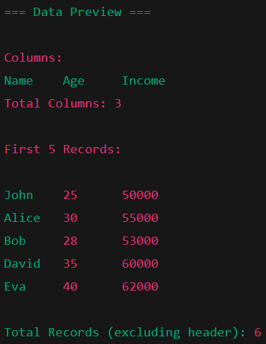

## Assignment 1

### Declaration
This document contains my individual work. No part of this assignment is copied from others. I am aware that a demo of each assignment will be taken, and marks will depend on implementation understanding.

---

### Objective
To read a CSV file, display columns, total number of columns, and display the first 5 records.

#### Key Concepts
- File Handling using `BufferedReader`
- String manipulation with `split()`
- Display list of columns
- Basic Data Preview

### Output (Sample)
Displays file columns, number of columns count, first 5 records of the dataset and total count (excluding header).

